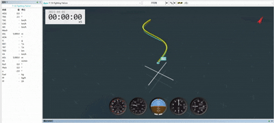
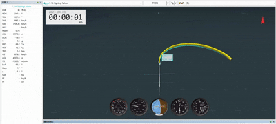
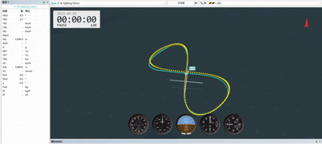
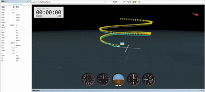
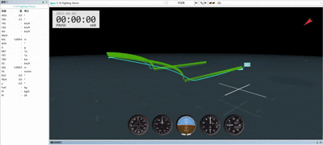
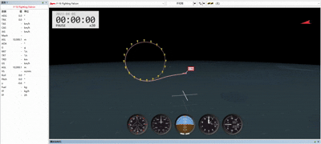

# Energy-Aware Target Streams for Learned Fixed-Wing Maneuvering

This repository contains a compact code release for learned fixed-wing maneuvering experiments. It keeps the runnable environment, target-stream utilities, evaluation scripts, small checkpoints, summarized results, and demo GIFs.

## What Is Included

- `envs/`: fixed-wing simulation environment, quaternion/vertical-energy task variants, rewards, terminations, simulator core, and utility code.
- `experiments/hierarchical_trajectory_tracking/`: target-stream generation, trajectory libraries, planner utilities, geometry-aware loop evaluation, rendering helpers, and ACMI export helpers.
- `configs/`: training and evaluation configuration files.
- `vedio/`: demos, preserving the original demo filenames.
- `results/`: summarized result tables, rollout summaries, metrics, and small checkpoints used by the code examples.
- `eval_euler_vs_quat_v2.py`: Euler-angle vs quaternion-conditioned skill comparison.
- `eval_vertical_energy_checkpoints.py`: baseline vs energy-aware vertical fine-tuning evaluation.
- `eval_loop_quality_aligned.py`: geometry-aware vertical-arc quality evaluation.
- `run_vertical_energy_balanced_v2.py` and `train_heading_pitch_V_discrete_rnn_quaternion_vertical_energy_finetune.py`: vertical-energy fine-tuning driver and training script.

## Demos

### 150° vertical climb


### S_curve



### chandelle_like



### figure_eight



### mild_3D



### wingover



### vertical loop



## Project Summary

The project studies fixed-wing maneuvering as a learning-control interface problem. A fixed-wing aircraft cannot treat a maneuver as waypoint tracking only: attitude, velocity direction, lift direction, energy state, actuator authority, and safety margins are coupled.

The workflow is:

1. Train a direct-actuator RL flight skill that outputs throttle, elevator, aileron, rudder, and speed brake.
2. Compare an Euler-angle target interface with a quaternion-conditioned target interface.
3. Use geometry-aware metrics to reveal pseudo-tracking: low cross-track error can coexist with wrong nose direction, wrong velocity tangent, wing-plane mismatch, angle-of-attack problems, or poor energy state.
4. Fine-tune the quaternion skill with energy-aware PPO terms for energy retention, low-speed safety, vertical progress, alpha/beta/G safety, smoothness, and replay of original tasks.
5. Represent long-horizon maneuvers as executable target streams of local heading, pitch, roll, and airspeed commands.
6. Select target-stream parameters with Receding-Horizon Target-Stream Optimization (RH-TSO), using short closed-loop rollouts through the frozen learned skill.

## Result Highlights

| Experiment | File | Key takeaway |
|---|---|---|
| Euler vs quaternion target encoding | `results/euler_vs_quat_comparison/` | Quaternion improves complex curve maneuvers such as circles, S-curves, and figure-eights; Euler remains competitive on simple pitch/pull-up tasks. |
| Energy-aware vertical fine-tune | `results/vertical_energy_finetune/20260515_1615/` | The epoch-619 vertical-energy skill improves energy/safety behavior and preserves much of the original horizontal/mild-3D capability. |
| Loop-quality frontier | `results/official_loop_quality_epoch619/20260517_173622/` | Geometry-aware evaluation quantifies vertical-arc and vertical-loop execution quality, including cross-track error, attitude alignment, velocity tangent, wing-plane consistency, and energy/safety behavior. |
| Target-stream parameter selection | `results/short_horizon_target_stream_selection/20260519_122354/` | Best lookahead/speed parameters are task dependent, motivating RH-TSO. |

RH-TSO improves CTE-P90 relative to the default `(L=1000, vt=250)` stream by:

| Task | Default CTE-P90 | Best CTE-P90 | Improvement | Best stream |
|---|---:|---:|---:|---|
| S-curve | 1503 m | 918 m | 39% | `(L=600, vt=220)` |
| Figure-eight | 1039 m | 1017 m | 2% | `(L=600, vt=220)` |
| Helix / mild-3D | 691 m | 524 m | 24% | `(L=600, vt=220)` |
| 90° vertical pull-up | 96 m | 51 m | 47% | `(L=1500, vt=280)` |

## Repository Layout

```text
.
├── configs/
├── envs/
├── experiments/hierarchical_trajectory_tracking/
├── results/
├── vedio/
├── eval_euler_vs_quat_v2.py
├── eval_vertical_energy_checkpoints.py
├── eval_loop_quality_aligned.py
├── run_vertical_energy_balanced_v2.py
└── train_heading_pitch_V_discrete_rnn_quaternion_vertical_energy_finetune.py
```

## Setup

Python 3.10 or 3.11 is recommended. Install a JAX/JAXLIB build that matches your CUDA or CPU environment, then install the remaining packages:

```bash
python -m venv .venv
source .venv/bin/activate
pip install --upgrade pip
pip install -r requirements.txt
```

For GPU runs, install the JAX CUDA wheel appropriate for your machine before running the training scripts.

## Reproduce Key Evaluations

Euler vs quaternion comparison:

```bash
python eval_euler_vs_quat_v2.py --seeds 10 --out-dir results/euler_vs_quat_comparison_rerun
```

Energy-aware vertical skill evaluation:

```bash
python eval_vertical_energy_checkpoints.py \
  --baseline results/heading_pitch_V_discrete_rnn_2026-05-13-21-17/checkpoints/checkpoint_epoch_600 \
  --new results/vertical_energy_finetune/20260515_1615/checkpoint/checkpoint_epoch_619 \
  --seeds 10 \
  --out-dir results/vertical_energy_finetune_rerun
```

Geometry-aware vertical-arc / vertical-loop frontier:

```bash
python eval_loop_quality_aligned.py \
  --checkpoint results/vertical_energy_finetune/20260515_1615/checkpoint/checkpoint_epoch_619 \
  --suite official \
  --no-compare \
  --out-dir results/official_loop_quality_epoch619_rerun
```

Dry-run the balanced vertical-energy training driver:

```bash
python run_vertical_energy_balanced_v2.py \
  --config configs/vertical_energy_balanced_finetune_v2_config.json \
  --cycles 1 \
  --dry-run
```

A small smoke training run can be launched with reduced environment count and timesteps:

```bash
TOTAL_TIMESTEPS=8192 NUM_ENVS=16 NUM_STEPS=64 NUM_MINIBATCHES=1 UPDATE_EPOCHS=1 \
python train_heading_pitch_V_discrete_rnn_quaternion_vertical_energy_finetune.py
```

Full training is compute-heavy and expects a working JAX accelerator setup.

## Limitations

- Current results are still simulation-only; sim-to-real transfer and real-flight validation remain future work.
- Additional real-world deployment studies are needed, including hardware-in-the-loop tests, onboard implementation, actuator/latency modeling, and flight-test evaluation.

